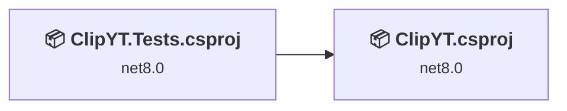
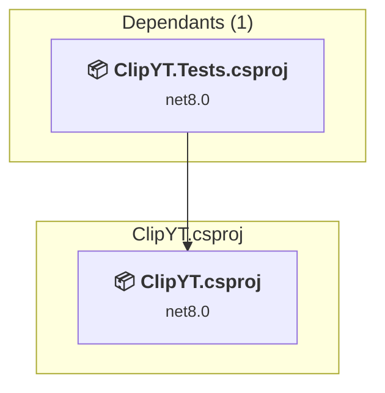
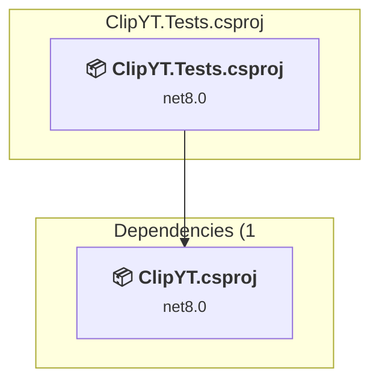

# Projects and dependencies analysis

This document provides a comprehensive overview of the projects and their dependencies in the context of upgrading to .NETCoreApp,Version=v10.0.

## Table of Contents

- [Executive Summary](#executive-Summary)
  - [Highlevel Metrics](#highlevel-metrics)
  - [Projects Compatibility](#projects-compatibility)
  - [Package Compatibility](#package-compatibility)
  - [API Compatibility](#api-compatibility)
- [Aggregate NuGet packages details](#aggregate-nuget-packages-details)
- [Top API Migration Challenges](#top-api-migration-challenges)
  - [Technologies and Features](#technologies-and-features)
  - [Most Frequent API Issues](#most-frequent-api-issues)
- [Projects Relationship Graph](#projects-relationship-graph)
- [Project Details](#project-details)

  - [ClipYT.csproj](#clipytcsproj)
  - [P:\Projects\clip-yt\src\ClipYT.Tests\ClipYT.Tests.csproj](#p:projectsclip-ytsrcclipyttestsclipyttestscsproj)

## Executive Summary

### Highlevel Metrics

| Metric | Count | Status |
| :--- | :---: | :--- |
| Total Projects | 2 | All require upgrade |
| Total NuGet Packages | 7 | 2 need upgrade |
| Total Code Files | 38 |  |
| Total Code Files with Incidents | 14 |  |
| Total Lines of Code | 2919 |  |
| Total Number of Issues | 103 |  |
| Estimated LOC to modify | 99+ | at least 3,4% of codebase |

### Projects Compatibility

| Project | Target Framework | Difficulty | Package Issues | API Issues | Est. LOC Impact | Description |
| :--- | :---: | :---: | :---: | :---: | :---: | :--- |
| [ClipYT.csproj](#clipytcsproj) | net8.0 | 🟢 Low | 1 | 58 | 58+ | AspNetCore, Sdk Style = True |
| [P:\Projects\clip-yt\src\ClipYT.Tests\ClipYT.Tests.csproj](#p:projectsclip-ytsrcclipyttestsclipyttestscsproj) | net8.0 | 🟢 Low | 1 | 41 | 41+ | DotNetCoreApp, Sdk Style = True |

### Package Compatibility

| Status | Count | Percentage |
| :--- | :---: | :---: |
| ✅ Compatible | 5 | 71,4% |
| ⚠️ Incompatible | 2 | 28,6% |
| 🔄 Upgrade Recommended | 0 | 0,0% |
| ***Total NuGet Packages*** | ***7*** | ***100%*** |

### API Compatibility

| Category | Count | Impact |
| :--- | :---: | :--- |
| 🔴 Binary Incompatible | 1 | High - Require code changes |
| 🟡 Source Incompatible | 7 | Medium - Needs re-compilation and potential conflicting API error fixing |
| 🔵 Behavioral change | 91 | Low - Behavioral changes that may require testing at runtime |
| ✅ Compatible | 4886 |  |
| ***Total APIs Analyzed*** | ***4985*** |  |

## Aggregate NuGet packages details

| Package | Current Version | Suggested Version | Projects | Description |
| :--- | :---: | :---: | :--- | :--- |
| coverlet.collector | 6.0.2 |  | [ClipYT.Tests.csproj](#p:projectsclip-ytsrcclipyttestsclipyttestscsproj) | ✅Compatible |
| Microsoft.NET.Test.Sdk | 17.11.1 |  | [ClipYT.Tests.csproj](#p:projectsclip-ytsrcclipyttestsclipyttestscsproj) | ✅Compatible |
| Microsoft.VisualStudio.Azure.Containers.Tools.Targets | 1.21.0 |  | [ClipYT.csproj](#clipytcsproj) | ⚠️NuGet package is incompatible |
| Moq | 4.20.72 |  | [ClipYT.Tests.csproj](#p:projectsclip-ytsrcclipyttestsclipyttestscsproj) | ✅Compatible |
| Serilog.AspNetCore | 10.0.0 |  | [ClipYT.csproj](#clipytcsproj) | ✅Compatible |
| xunit | 2.9.0 |  | [ClipYT.Tests.csproj](#p:projectsclip-ytsrcclipyttestsclipyttestscsproj) | ⚠️NuGet package is deprecated |
| xunit.runner.visualstudio | 2.8.2 |  | [ClipYT.Tests.csproj](#p:projectsclip-ytsrcclipyttestsclipyttestscsproj) | ✅Compatible |

## Top API Migration Challenges

### Technologies and Features

| Technology | Issues | Percentage | Migration Path |
| :--- | :---: | :---: | :--- |

### Most Frequent API Issues

| API | Count | Percentage | Category |
| :--- | :---: | :---: | :--- |
| T:System.Uri | 54 | 54,5% | Behavioral Change |
| T:System.Net.Http.HttpContent | 16 | 16,2% | Behavioral Change |
| M:System.Uri.#ctor(System.String) | 13 | 13,1% | Behavioral Change |
| M:System.Uri.TryCreate(System.String,System.UriKind,System.Uri@) | 5 | 5,1% | Behavioral Change |
| M:System.TimeSpan.FromSeconds(System.Double) | 5 | 5,1% | Source Incompatible |
| M:System.TimeSpan.FromMinutes(System.Double) | 1 | 1,0% | Source Incompatible |
| M:System.Net.Http.HttpContent.ReadAsStreamAsync(System.Threading.CancellationToken) | 1 | 1,0% | Behavioral Change |
| M:System.TimeSpan.FromMilliseconds(System.Double) | 1 | 1,0% | Source Incompatible |
| M:Microsoft.AspNetCore.Builder.ExceptionHandlerExtensions.UseExceptionHandler(Microsoft.AspNetCore.Builder.IApplicationBuilder,System.String) | 1 | 1,0% | Behavioral Change |
| M:Microsoft.Extensions.Configuration.ConfigurationBinder.GetValue''1(Microsoft.Extensions.Configuration.IConfiguration,System.String) | 1 | 1,0% | Binary Incompatible |
| M:Microsoft.Extensions.DependencyInjection.HttpClientFactoryServiceCollectionExtensions.AddHttpClient(Microsoft.Extensions.DependencyInjection.IServiceCollection,System.String) | 1 | 1,0% | Behavioral Change |

## Projects Relationship Graph

Legend:
📦 SDK-style project
⚙️ Classic project

## Project Details

### ClipYT.csproj

#### Project Info

- **Current Target Framework:** net8.0
- **Proposed Target Framework:** net10.0
- **SDK-style**: True
- **Project Kind:** AspNetCore
- **Dependencies**: 0
- **Dependants**: 1
- **Number of Files**: 68
- **Number of Files with Incidents**: 11
- **Lines of Code**: 2523
- **Estimated LOC to modify**: 58+ (at least 2,3% of the project)

#### Dependency Graph

Legend:
📦 SDK-style project
⚙️ Classic project

### API Compatibility

| Category | Count | Impact |
| :--- | :---: | :--- |
| 🔴 Binary Incompatible | 1 | High - Require code changes |
| 🟡 Source Incompatible | 7 | Medium - Needs re-compilation and potential conflicting API error fixing |
| 🔵 Behavioral change | 50 | Low - Behavioral changes that may require testing at runtime |
| ✅ Compatible | 4272 |  |
| ***Total APIs Analyzed*** | ***4330*** |  |

### P:\Projects\clip-yt\src\ClipYT.Tests\ClipYT.Tests.csproj

#### Project Info

- **Current Target Framework:** net8.0
- **Proposed Target Framework:** net10.0
- **SDK-style**: True
- **Project Kind:** DotNetCoreApp
- **Dependencies**: 1
- **Dependants**: 0
- **Number of Files**: 4
- **Number of Files with Incidents**: 3
- **Lines of Code**: 396
- **Estimated LOC to modify**: 41+ (at least 10,4% of the project)

#### Dependency Graph

Legend:
📦 SDK-style project
⚙️ Classic project

### API Compatibility

| Category | Count | Impact |
| :--- | :---: | :--- |
| 🔴 Binary Incompatible | 0 | High - Require code changes |
| 🟡 Source Incompatible | 0 | Medium - Needs re-compilation and potential conflicting API error fixing |
| 🔵 Behavioral change | 41 | Low - Behavioral changes that may require testing at runtime |
| ✅ Compatible | 614 |  |
| ***Total APIs Analyzed*** | ***655*** |  |

#### Project Package References

| Package | Type | Current Version | Suggested Version | Description |
| :--- | :---: | :---: | :---: | :--- |
| coverlet.collector | Explicit | 6.0.2 |  | ✅Compatible |
| Microsoft.NET.Test.Sdk | Explicit | 17.11.1 |  | ✅Compatible |
| Moq | Explicit | 4.20.72 |  | ✅Compatible |
| xunit | Explicit | 2.9.0 |  | ⚠️NuGet package is deprecated |
| xunit.runner.visualstudio | Explicit | 2.8.2 |  | ✅Compatible |

